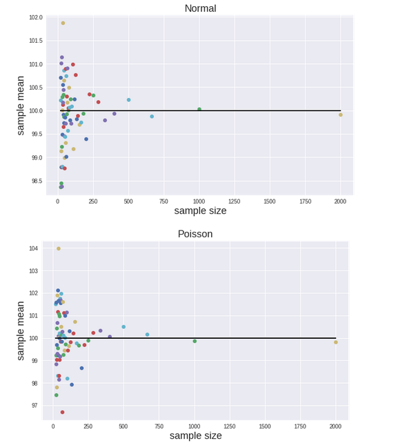
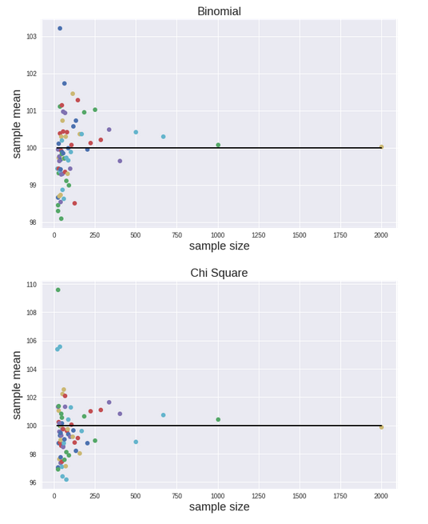
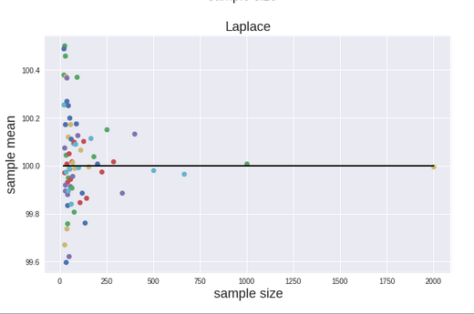
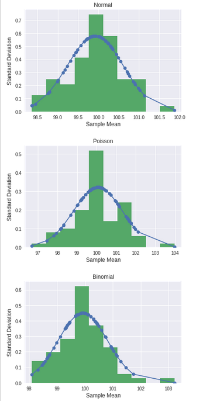
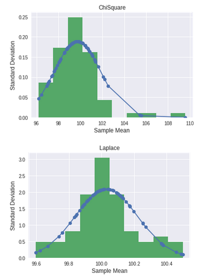
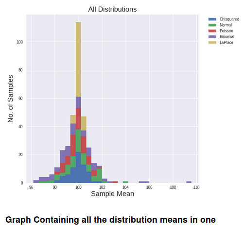

Study of Central Limit Theorem

In this Project we demonstrates visually in a data-driven way the Central Limit Theorem.

Generated 100 samples of different sizes N (N>10 & N<2000) from each of 5 different distributions (500 samples in total), all with the same population mean

A Normal, a Poisson, a Binomial, a Chi-Squared distribution, and a Laplace distribution were demonstrated.

For each sample plot the sample mean (dependent var.) against the sample size N (independent var.) were plotted.

A gaussian blanket was fit over the distribution of means.

*Distributions:*

*Histograms*

*All Distributions*

